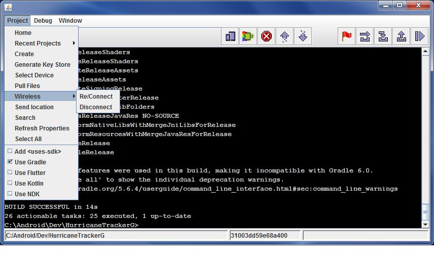
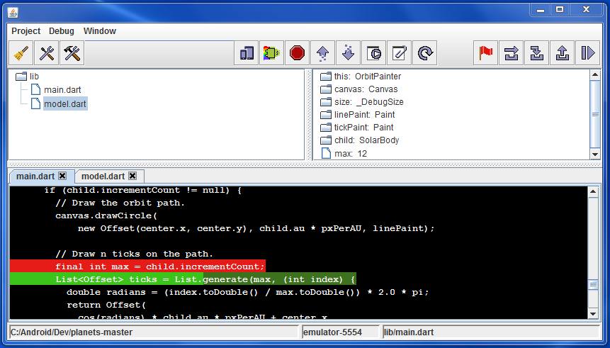

## A lightweight Android development tool.  Wraps the Android SDK's Ant, 'android' and 'adb'.

# Features:

* Create and build: Gradle, Kotlin, Flutter and Android Ant projects.
* Gradle, Kotlin and Flutter projects can use the latest Android SDK.
* Integrated Java Debug Wire Protocol debugger.
* Flutter debugger.
* Runs on Windows, Linux and Mac.
* Supports Gradle: clean, assembleDebug and assembleRelease (uninstall and install handled by adb)
* Keystore generator for App Bundles.
* Flutter has "Run", "Attach" and "Hot Reload" buttons.
* Use adb wireless debugging over Wi-Fi, no root required.
* Fast development cycle to build load and debug your application on the Emulator or your Android device.
* Logcat: Color highlighting for warning and error messages with filter options to block unwanted tags.
* Option to show log output by Process Id.

# Screenshots:

